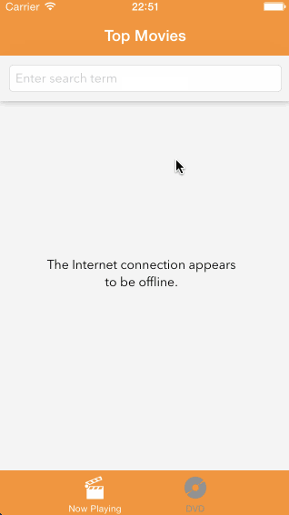

# CodePath iOS Week 1: Rotten Tomatoes

Time spent: 20 hours spent in total

Completed user stories:

* [x] Required: View a list of movies from Rotten Tomatoes. Poster images load asynchronously.
* [x] Required: View movie details by tapping on a cell
* [x] Reqruied: Loading state while waiting for the movies API (I decided to go with the standand iOS control instead of a 3rd party library)
* [x] Reqruied: Error messsage whent here is a networking error. Error message is center when the view is initially empty; and is docked to the top once there is content loaded.
* [x] Required: Pull down to refresh
* [x] Optaionl: All images fade in
* [x] Optional: Load low-res images first, and then switch to high-res when complete
* [x] Optional: Customize the navigation bar
* [x] Optional: Added a tab bar for Box Office and DVD
* [x] Optional: Added search (local filter on the existing list)

Additonal things I tried to experiment with:
* Used a collection view controller instead of the table view controller.
* Tab bar hides when the user is scrolling down and appears when the user scrolls back up (Pinterest-like)
* Fetch more items via another API call for the next page of items when the user is nearing the end of the list.

Questions and Known Issues:
* Since I created my CollectionViewController in storyboard, I'm not sure what the best way is to add the second tab. I created a new instance of the CollectionViewController in viewDidLoad of my TabBarViewController. It was weird to mix doing some things in storyboard and others programmatically.
* I used setImageWithURLRequest to load the low res image first, and then load the high res image on success. However, I see that for some movies, the details view is immediately showing the high res image... and for some others, the low res image never gets updated to the high res one. I'm not sure if my network is just slow or I'm not quite doing this properly.

Video Walkthroughs:

Core experience

Error messages

